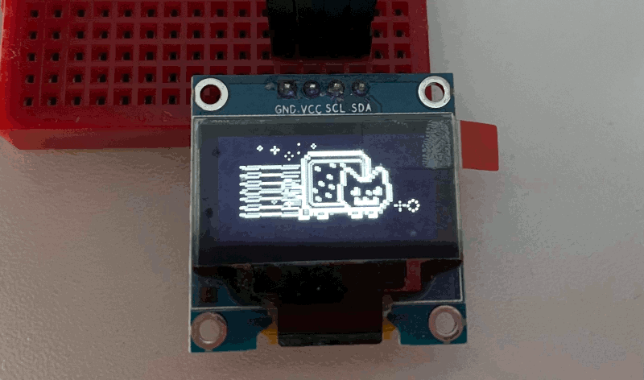

# Nyan Scroller

***

Just more ore less modern port of of my old old code.
It should work pretty much on any MCU, but require a few GPIO tweaks inside "pins.h".

Works with SSD1306 oled screens.
Tested under ESP32.

Also require to install Arduino libraries:
 - Adafruit_SSD1306
 - Adafruit-GFX-Library
 - Adafruit_BusIO

[To check how the oldy goldy one works, check this link](https://www.youtube.com/watch?v=csOh66p9-Ug "Nyan cat on ssd1306 display")

***
### Lists of known issues:
 - Rainbow and Nyan body pops in on left part of the screen (Adafruit lib have problems with culling edges of Bitmap images).
 - Nyan body is transparent and show stars behind it. (Lets pretend what stars actually in front of the Nyan Cat and it's a feature :))
